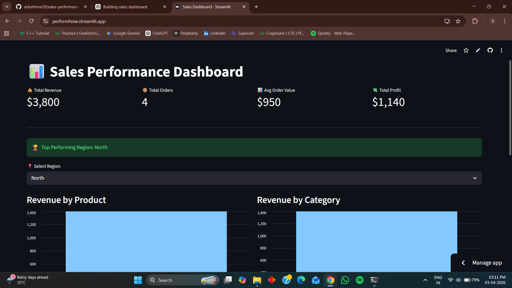

# 📊 Sales Performance Dashboard

## 🚀 Overview

This project is an end-to-end data analytics pipeline that processes raw sales data and visualizes key business insights using an interactive dashboard.

---

## 🛠 Tech Stack

* Python (Pandas, NumPy)
* SQL (SQLite)
* Streamlit
* Excel

---

## 📂 Workflow

1. Data Cleaning using Python
2. Data Storage in SQL
3. KPI Calculation
4. Interactive Dashboard

---

## 📊 Features

* Total Revenue Tracking
* Average Order Value (AOV)
* Region-wise Filtering
* Product Performance Analysis

---

## 📸 Dashboard Preview

---

## ▶️ Run Locally

pip install -r requirements.txt
python -m streamlit run app.py
